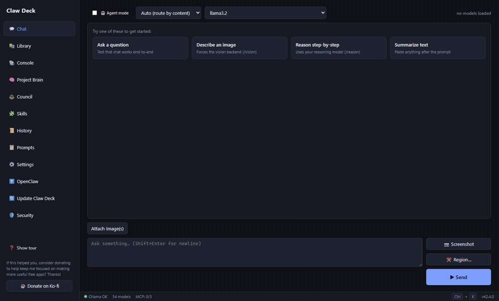
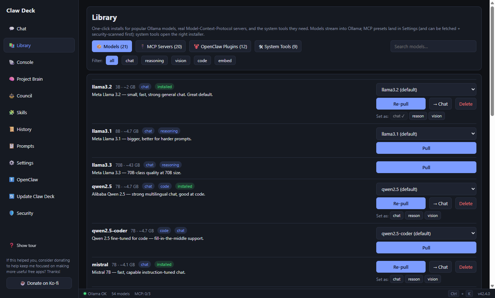
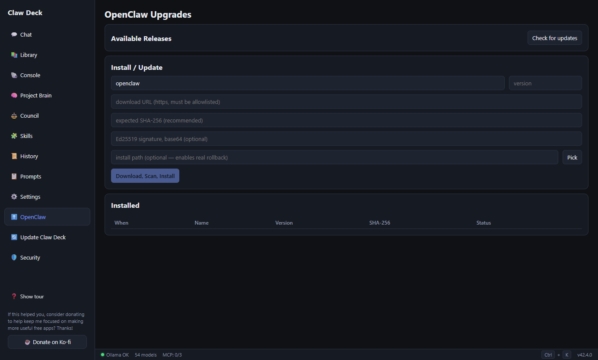
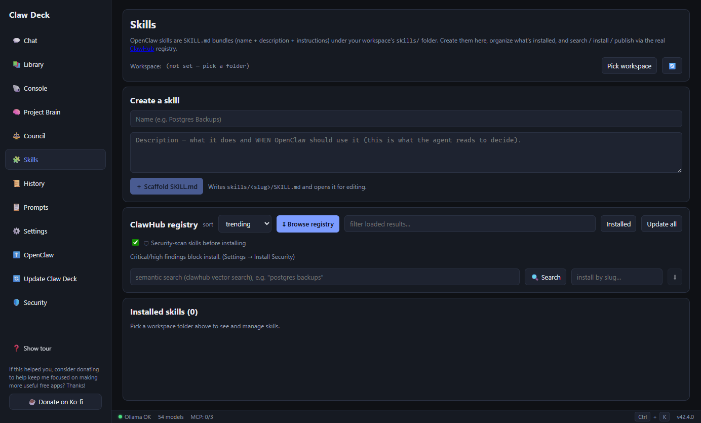
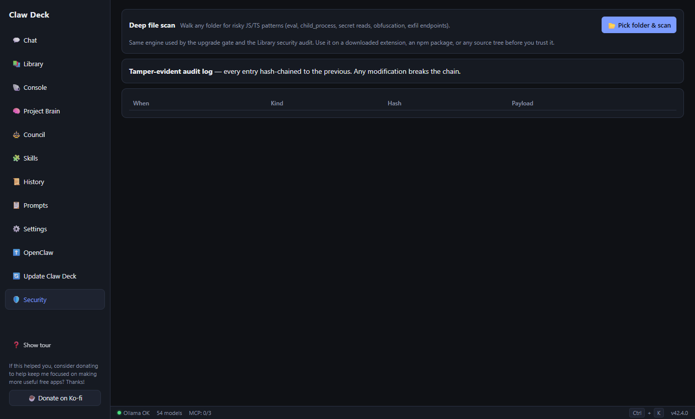
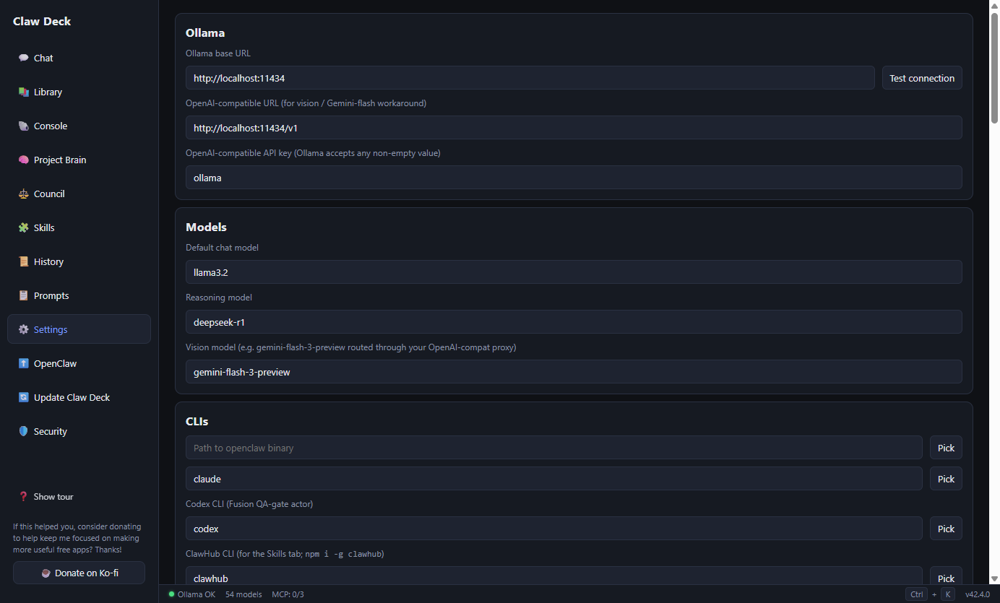
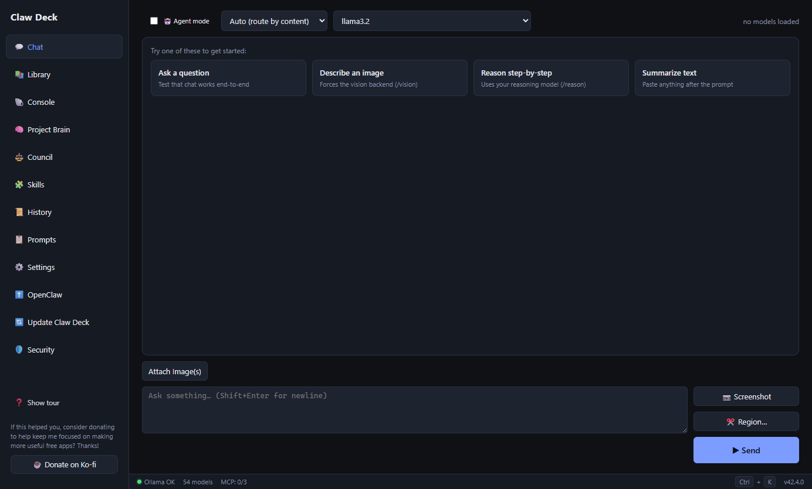

<div align="center">

# 🦞 Claw Deck

### A local-first desktop command deck for **OpenClaw** & **Claude Code** — running on your own **Ollama** models, with a hardened, malware-scanned upgrade pipeline.

[](https://github.com/Slagathore/claw-deck/releases/latest)
[](https://github.com/Slagathore/claw-deck/releases)
[](LICENSE)


### [⬇️ Download the latest release](https://github.com/Slagathore/claw-deck/releases/latest)



</div>

---

## What is this?

**Claw Deck** wraps your local **Ollama** stack in a real desktop GUI — then adds the parts most local-LLM front-ends skip: a **multi-agent council**, a queryable **code map**, an **OpenClaw skills** pipeline, and a **security gate** that scans, hashes, and signature-checks anything before it touches your machine.

Everything runs against `localhost`. **No account, no cloud inference, no telemetry** — the only outbound calls are the ones you opt into (GitHub release polling and optional VirusTotal *hash* lookups).

## ✨ Highlights

| | |
|---|---|
| 💬 **Chat** | Streaming Ollama chat with an **`Auto`** backend that routes to chat / vision / reasoning by content — plus `/vision` `/reason` `/chat` overrides. Flip on **Agent mode** and it writes a JSON plan → you approve → it executes each step and feeds results back to itself. |
| 📚 **Library** | One-click installs for **21 popular models**, **20 real MCP servers** (verified `npx`/`uvx` packages), **12 OpenClaw plugins**, and system tools — each **scanned before install**. |
| ⚖️ **Council** | Multi-workspace **agent council**: assign panelists / judge / QA from a roster, run a debate protocol, watch the "theater," and approve or reject the resulting diff in-tab. |
| 🧠 **Project Brain** | **Atlas** — a queryable map of any codebase: symbols, call/reference edges, and active / orphaned / deprecated / superseded status tags. Powers the `code-brain` MCP server. |
| 🧩 **Skills** | Full **OpenClaw `SKILL.md`** pipeline — scaffold, organize, and publish skills, with **semantic search** and install/inspect via the real **ClawHub** registry. |
| 🐚 **Console** | OpenClaw / Claude Code **and** any shell (PowerShell / cmd / Git Bash / WSL) in a **real pseudo-terminal** (node-pty + xterm.js — colors, line editing, `isatty`), with UAC-elevated launch. |
| 🛡️ **Secure upgrades** | Every install runs a gate: **allowlist → quarantine → SHA-256 → Ed25519 signature → AV + YARA → VirusTotal → install with backup → tamper-evident ledger → real rollback**. |
| 📜 **History** | SQLite-backed, searchable log of **every** turn — chat, agent plans, console sessions — with one-click branch (↳) to reuse a prior prompt. |
| 🖼️ **Vision** | Multi-image attach + one-click **desktop screenshot** and **region-crop**, routed through the OpenAI-compatible path for reliable tool-calling. |
| ⌨️ **Command palette** | `Ctrl+K` from anywhere. Plus a live status bar (tok/s · TTFT · VRAM) and an **air-gapped mode** that kills all outbound calls with one toggle. |

## 📸 Screenshots

| Library — models, MCP servers & plugins | Secure upgrade gate |
|---|---|
|  |  |

| Skills — `SKILL.md` + ClawHub | Security — deep scan & tamper-evident log |
|---|---|
|  |  |

| Settings | Chat |
|---|---|
|  |  |

## 📥 Install

**Prerequisite:** [Ollama](https://ollama.com) running locally (that's where your models live).

Grab a build from the **[latest release](https://github.com/Slagathore/claw-deck/releases/latest)**:

| Platform | Asset | Notes |
|---|---|---|
| **Windows** | `Claw.Deck-…-x64.exe` | Installer — **Authenticode-signed** (publisher: Charles Chambers) |
| **Windows (portable)** | `Claw.Deck-…-portable-x64.exe` | Single standalone exe, no install needed — also signed |
| **macOS** | `Claw.Deck-…-mac-arm64.dmg` / `-x64.dmg` | Apple Silicon / Intel. Unsigned — right-click → **Open** on first launch |
| **Linux** | `Claw.Deck-…-linux-x86_64.AppImage` | `chmod +x` and run |

First launch runs a 3-step tour that finds your Ollama, confirms a default model, and gets you chatting. Pull a model from the **Library** tab (or `ollama pull llama3.2`) and go. In-app updates arrive through the same **security gate** as everything else — hash-checked and scanned before install.

## 🚀 Run from source

**Prerequisites:** Node.js 20+ (Windows is the primary target; macOS/Linux build too).

```powershell
git clone https://github.com/Slagathore/claw-deck.git
cd claw-deck
npm install
npm run dev      # Vite + Electron in dev (hot reload)
# or
npm start        # build + run
npm test         # vitest — 367 tests
```

## 🛡️ Security model

Claw Deck treats **every** update — OpenClaw plugins, MCP servers, its own self-upgrades — as untrusted until proven otherwise. The gate runs in order:

1. **Air-gap check** — hard-blocked when air-gapped mode is on.
2. **HTTPS + allowlist** — host must be in `settings.policy.allowlist`.
3. **Quarantine download** — lands in `userData/quarantine/<ts>-<file>`, never executed.
4. **SHA-256 compare** vs the expected hash.
5. **Ed25519 signature verify** — checked against `policy.signingKeys`; `requireSignature` rejects anything unsigned.
6. **AV scan** — Windows Defender (`MpCmdRun.exe`) + ClamAV when present, plus **YARA** rules.
7. **VirusTotal hash lookup** *(optional)* — queries the file's SHA-256 against VT v3 (no upload); any malicious/suspicious verdict blocks it.
8. **Install with backup** — vetted file copied to its target; any prior file backed up to `<path>.bak-<ts>`.
9. **Tamper-evident ledger** — every decision appended to a **hash-chained** audit log; altering any entry breaks the chain.
10. **Real rollback** — restores the backup (or removes the file) on demand.

The same scan engine powers the standalone **Deep folder scan** (Security tab) — point it at any downloaded extension or npm package before you trust it.

## 🏗️ Architecture

- **Electron 42 + React 18 + TypeScript 5.5 + Vite 8** renderer, strict TS throughout.
- **Node main process** with a fully typed IPC bridge (`contextIsolation`, no `nodeIntegration`) and **`better-sqlite3`** persistence.
- **Atlas** code-intelligence engine (tree-sitter/TS-program parsing → SQLite + vector search via `sqlite-vec`).
- **367 tests** across 42 files (Vitest).

<details>
<summary><strong>🖥️ Headless CLI</strong></summary>

Once installed, `claw-deck` doubles as a CLI (it reads the same settings DB the GUI writes):

```powershell
claw-deck run --task "Summarize this PR" --model llama3
claw-deck run --task "Describe this image" --image ./screenshot.png
claw-deck settings --json
claw-deck help
```
</details>

<details>
<summary><strong>📦 Building installers</strong></summary>

```powershell
npm run dist           # renderer + electron + NSIS installer + portable .exe
npm run dist:portable  # portable only
npm run dist:nsis      # NSIS installer only
```

Outputs land in `dist-installer/`.
</details>

<details>
<summary><strong>🔏 Code signing</strong></summary>

**Official Windows releases are Authenticode-signed** via **Azure Artifact Signing** (publisher: *Charles Chambers*), with RFC-3161 timestamps — so signatures stay valid after certificate rotation. Verify any downloaded exe:

```powershell
Get-AuthenticodeSignature '.\Claw Deck-*.exe' | Format-List Status, SignerCertificate
# Expect: Status Valid, CN=Charles Chambers
```

Signing is maintainer-only (gated behind `CLAW_SIGN=1` — see [SIGNING.md](SIGNING.md)):

```powershell
npm run dist          # unsigned local build
npm run dist:signed   # Azure-signed build (requires az login + signing role)
```

The hook lives at [scripts/azure-sign.js](scripts/azure-sign.js), wired via `build.win.signtoolOptions.sign`. Note: SmartScreen reputation on a certificate builds with download volume, so early downloads may see a soft "not commonly downloaded" notice — with the publisher shown as verified.
</details>

<details>
<summary><strong>🔄 Auto-update channel</strong></summary>

The **Update Claw Deck** tab polls the GitHub release feeds under *Settings → Upgrade Feeds*, compares the latest release to `app.getVersion()` via semver, auto-picks the right asset for your platform/arch, and runs it through the full security gate before installing.

**Update visibility.** On launch, Claw Deck checks the self-update feed and shows an *"Update available"* banner when a newer release exists. You can silence it two ways — **Later** (snooze until a newer version ships) or **Don't remind me** (mute forever) — both remembered across restarts.

**Emergency updates override silence.** A release can mark itself urgent by putting a marker in its GitHub release notes; Claw Deck then shows a blocking message *regardless* of a user's snooze/mute. The marker is an HTML comment (invisible in GitHub's rendered notes):

```
<!-- clawdeck:emergency: Fixes a critical RCE — please update immediately. -->
```

**Close-window behavior** is configurable under *Settings → UX*: **Minimize to taskbar**, **Hide to system tray** (keep running in the background), or **Quit**.
</details>

<details>
<summary><strong>💡 Gemini-flash through Ollama (OpenAI path)</strong></summary>

Gemini-flash variants frequently break tool-calling on the native Anthropic-shaped endpoint. The forum-recommended workaround — routing through the **OpenAI-compatible** endpoint (`/v1/chat/completions`) and passing images as base64 `image_url` parts — is what Claw Deck does by default for the **Vision** backend.

```
Ollama base URL            : http://localhost:11434
OpenAI-compatible URL      : http://localhost:11434/v1     (or your LiteLLM proxy)
OpenAI-compatible API key  : ollama                        (any non-empty value)
Vision model               : gemini-flash-3-preview        (or whatever your proxy exposes)
```
</details>

## 📂 Data locations

- **DB:** `%APPDATA%/claw-deck/data/clawdeck.db`
- **Quarantine:** `%APPDATA%/claw-deck/quarantine/`

## ❤️ Support

Claw Deck is free and MIT-licensed. If it saved you time, you can fuel more free tools:

<a href="https://ko-fi.com/sparklemuffin"></a>

## 📄 License

[MIT](LICENSE) © Slagathore
